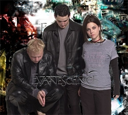
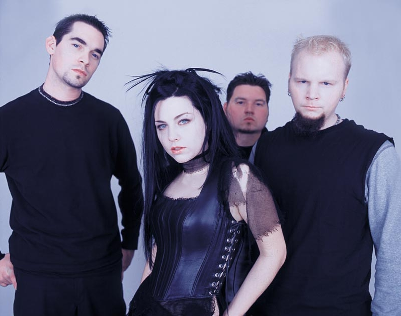
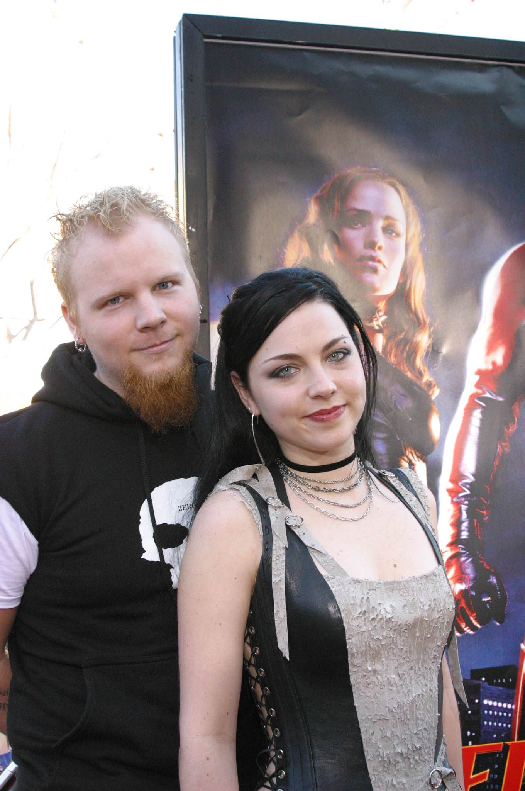
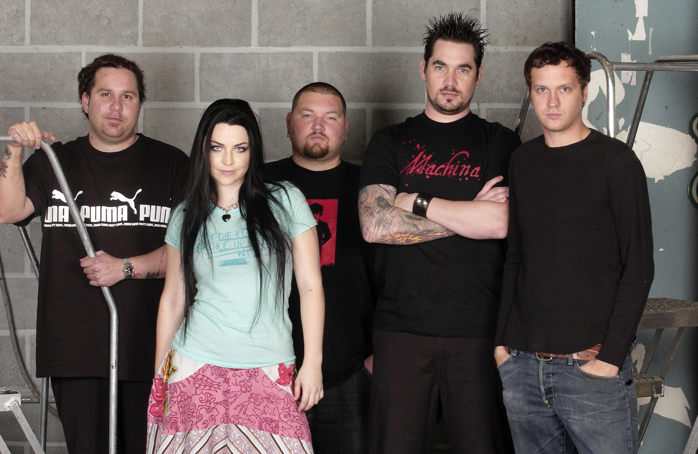
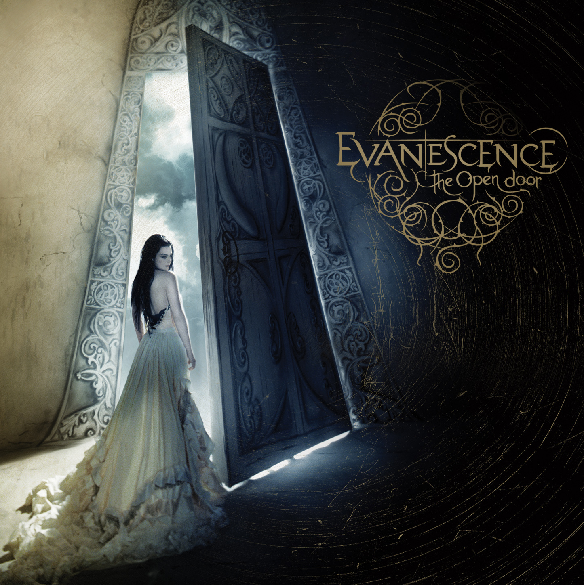

## Создание (1995 - 2001 г.)

Группа Evanescence появилась в 1995 году. Её основателями стали вокалистка Эми Ли и гитарист Бен Муди, в последствии покинувший группу. Ходят слухи, что они познакомились в молодёжном лагере городка Литл Рок в Арканзасе, где Муди услышал, как Эми играла на фортепиано песню «I'd Do Anything For Love» группы «Meat Loaf», но этот факт был опровергнут Ли в одном из интервью журналу «Rolling Stones».

Их первыми работами стали песни «Solitude» и «Give Unto Me», обе написанные Эми, и «Understanding» и «My Immortal», написанные Беном. Песни были отредактированы и доработаны обоими музыкантами. Через некоторое время эти песни появились в эфире местных радиостанций, группа получила первых слушателей и некоторую популярность ещё до начала первых концертов. Первое их живое выступление стало главным событием в городе. После экспериментов с названиями группы, такими как «Childish Intentions» или «Stricken», они остановились на «Evanescence», от слова evanesce (исчезнуть).

Коллектив выпустил две пластинки (Evanescence EP и Sound Asleep EP) в 1998 и 1999 годах соответственно. Небольшое число копий этих CD было выпущено лейблом Bigwig Enterprises.

    <figure>
        
        <figcaption>Первый состав Evanescence: Эми Ли, Бен Муди и Девид Ходжес. Фото 2000 г.</figcaption>  
    </figure>

> <cite>Эми Ли:</cite>
> «Когда группа только появилась, мне было 14 или около этого, и всё что мы имели - это несколько текстов песен и домашних записей. На протяжении всего времени учёбы в старшей школе, Бен и я (и позже Дэвид) посвящали всё свободное время нашему увлечению, создавали новые песни и играли их в разных клубах и кафе. «Origin» - это коллекция всех наших домашних записей на 2001 год (думаю, наверное, на 2000…). Во всяком случае, тогда мы ещё только пробовали, учились создавать музыку. Я всегда чувствую, что наша музыка «выросла» и улучшилась с тех пор и хочу продолжать делать её ещё лучше и лучше, а не оглядываться назад. Честно говоря, мне трудно слушать очень старые записи без смеха над собой в прошлом. Но, конечно, эти песни всегда будут особенными для меня. Они напоминают о времени в моей жизни, которое было и прекрасным и ужасным. Это так здорово, что у меня есть эти записи, можно вернуться и слушать, то, что мы записали, когда были подростками, и вспомнить всё что забылось».

Их первый альбом «Origin» (происхождение) был выпущен 4-го ноября 2000 года. В списке авторов указаны Эми, Бен и Дэвид Ходжес. Сама Эми считает эти записи скорее не альбомом, а сборником демо записей (и некоторые, по её словам, исполнены не правильно), которые были отправлены в звукозаписывающие кампании. Этот диск был выпущен на местном лейбле ограниченным тиражом в 2500 копий, которые были полностью проданы на концертах группы. Оригинальных записей альбома почти не осталось в магазинах, и они превратились в раритеты. Впоследствии, Evanescence разрешили некоммерческое распространение старых альбомов через Интернет.

## FALLEN. (2002-2005)

Дэвид Ходжес покинул группу в декабре 2002, за четыре месяца до выхода альбома Fallen. Дэвид видел Evanescence, как христианскую рок-группу, но Бен и Эми отказались от этого. Перед выходом этого альбома, в январе на одном из концертов был продан диск «Mystary EP» на котором можно услышать несколько разных версий новых песен. В момент выпуска первого дебютного альбома «Fallen» лейблом Wind-Up Records, в группе кроме Эми Ли и Бена Муди играли гитарист Джон ЛеКомпт, басист Уильям Бойд и ударник Роки Грэй. В тот же день вышел первый сингл Evanescence - «Bring Me To Life». Эта песня стала всемирно известным хитом группы. В её записи принимал участие солист христианской группы «12 Stones» Пол МакКой. Песни «Bring Me to Life», и фортепианная баллада «My Immortal» вошли в саундтрек к фантастическому боевику-комиксу «Сорвиголова» (Daredevil). Evanescence получили сразу две награды Grammy в номинациях «Лучшая новая группа» и «Лучшее хард-рок-выступление». Альбом попадает в хит-парад журнала Billboard, где ему удается продержаться более 100 недель, а журнал Rolling Stone называет вокалистку Эми Ли «человеком года». Всего было продано 15 миллионов копий альбома «Fallen» по всему миру.

    

        <figure>
            
            <figcaption>Фотосессия Evanescence времен альбома Fallen. </figcaption>  
        </figure>
        <figure>
            
            <figcaption>Бен Муди и Эми Ли на премьере фильма «Сорвиголова» (Daredevil), где их песня стала саундтреком, фото 2003 г.</figcaption>  
        </figure>
    

><cite>Из интервью Эми Ли</cite>
>Включение Bring Me To Life в саундтрэк к фильму «Сорвиголова» (а также My Immortal) тоже очень помогло группе. «Это как песня стала популярной в стране, а потом и во всем мире. Это моя любимая часть истории – это произошло не потому что нас проталкивали вверх наши продюсеры, а потому что мы понравились людям. Кем бы мы были без фанов? Никем».

Вскоре в группе появляется еще один музыкант – басист Уилл Бойд. А 22 октября 2003 года Бен Муди покидает группу в середине европейского тура, как сообщалось, из-за творческих разногласий. Его объяснение событий можно прочитать в открытом письме к поклонникам, опубликованном спустя 7 лет. В интервью через несколько месяцев, Эми Ли сказала: «Это действительно стало облегчением, хотя я и не имею ничего против Бена, но мы уже прошли через многое и были на пределе. Мы дошли до края, что-то должно было измениться, иначе мы бы просто не смогли записать свою вторую пластинку».

Тем временем, Бен находит себе место в коллективе Аврил Лавинь.

На место Бена Муди пришёл бывший гитарист «Cold» Терри Бальзамо. В 2003-2004 годах вышли ещё три сингла: «Going Under», «Everybody's Fool» и «My Immortal». Впоследствии, песня «My Immortal» стала одной из самых известных песен группы.

В 2004 году Evanescence выпустили концертный альбом на CD и DVD – «Anywhere but home». Релиз состоялся 22 ноября 2004 года. На дисках можно увидеть видеозапись концерта в Париже, а также все видеоклипы к первому альбому, и интересные моменты, оставшиеся за кадром. Среди известных песен группы были также такие вещи, как новая песня «Missing», песенка «Breathe No More», записанная для саундтрека фильма «Электра», и кавер-версия песни группы Korn «Thoughtless».

## THE OPEN DOOR. (2006–2009)

Представители лейбла подтвердили, что Уильям Бойд покинул группу по собственному желанию. Он остался в хороших отношениях с музыкантами, но заявил что не готов «отправиться в еще одно бесконечное турне», и хочет проводить больше времени со своей семьёй. В интервью MTV, Эми Ли сообщила, что место Бойда в группе займёт новый басист Тим МакКорд. Запись альбома шла медленно, и релиз откладывается по нескольким причинам. В самом разгаре работы, гитарист Терри Бальзамо пережил инсульт. Кроме того, Эми Ли, при работе над новой пластинкой, не хотела торопить события – творческий процесс должен был развиваться постепенно, с той скоростью, с которой необходим.

    

        <figure>
            
            <figcaption>Состав Evanescence в 2006 году. </figcaption>  
        </figure>
        <figure>
            
            <figcaption>Обложка альбома «The Open Door»</figcaption>  
        </figure>
    

> <cite>Эми Ли</cite>
> «Мы никуда не торопимся», - говорит она. «Fallen был очень успешным альбомом, но мы не хотим записать такой же альбом еще раз. Какой смысл? Мы хотим, чтобы наш альбом был оригинальным, как был наш первый альбом. Мы пишем отдельно друг от друга, но скоро мы соберемся вместе и начнем совместную работу»

В итоге, второй альбом под названием The open door вышел 30 сентября 2006 года, в Австралии и Италии, 2 октября 2006 года, в Европе и 3 октября 2006 года, в Северной Америке. Он был записан на студии «Record Plant» в Голливуде, штат Калифорния, и смикширован в «Ocean Way Studios» в марте 2006 года. Альбому предшествовал сингл «Call Me When You Sober», и клип на эту песню. Джон ЛеКомпт официально ушёл из Evanescence 4 мая 2007 года по неизвестным причинам. Вместе с ним, группу покинул ударник Роки Грэй. Некоторые считают, что он сделал это в знак протеста увольнению Джона, но это не так, Роки хотел оставить группу ещё в январе, но по условию контракта с Wind-Up, должен был закончить тур в поддержку второго альбома. 17 мая 2007 года, вышел пресс релиз, в котором сообщалось, что к Evanescence присоединяются ударник Уилл Хант и гитарист Трой Маклохорн из «Dark New Day». В этом составе, группа заканчивает свой тур в поддержку альбома «The Open Door».

## ТРЕТИЙ СТУДИЙНЫЙ АЛЬБОМ - EVANESCENCE. (2009-2012)

В новостной рассылке официального сайта Evanescence, в июне 2009, появилось сообщение о том, что группа находится в процессе написания нового материала для нового альбома, который должен был выйти в 2010 году. Эми Ли, рассказала, что музыка будет сильно отличаться, от всего что было записано ранее. В группе появляется ещё один Уилл Хант, получивший прозвище «Science» (Учёный). «Новый» Хант, играет барабанные партии и занимается программированием. Группа также объявила о выступлении на Maquinaria Festival в Сан-Паулу, Бразилия 8 ноября 2009 года. До появления на фестивале было сыграно «секретное шоу» в Manhattan Center Grand Ballroom в Нью-Йорке 4 ноября 2009 вместе с коллективом под названием Civil Twilight. Все билеты были распроданы менее чем за 10 минут.

22 января 2010 года был выпущен «Together Again». Этот сингл, распространявшийся только в цифровом виде через интернет, Evanescence выпустили эту песню, чтобы материально помочь пострадавшим на Гаити. Она была записана в период The Open Door, но не вошла в альбом. Скачать её можно за 5$ в любое время, все вырученные средства пошли на благотворительность. Выход альбомы был отложен вновь.

1 марта 2011 года Evanescence вернулись в студию на пре-продакшн нового альбома. Продюссером альбома стал Ник Раскулинеш. 11 апреля 2011 года Evanescence уже собираются в студии для записи нового альбома. Стала известна новая дата релиза третьего альбома — 4 октября, также в группу вернулся Трой Маклоухорн.

Evanescence вернулись на сцену 20 августа на фестивале Rock on the Range. Выход одноимённого альбома Evanescence был перенесён на 11 октября 2011 года, когда стало известно, что запись альбома полностью завершена. Первый сингл получил название What You Want, его релиз состоялся 9 августа. После этого вышли ещё три сингла: «My Heart Is Broken», «Lost In Paradise» и «The Other Side»; последний, являясь только радио-синглом, не выпускался на каких-либо носителях. В поддержку нового альбома группа провела мировое турне, которое завершилось 2 сентября 2012 года в американском городе Буффало, штат Нью-Йорк. Концерты группы прошли в том числе и в России: 26 июня в Санкт-Петербурге, а 27 июня - В Москве. После масштабного тура по миру группа вновь ушла на длительный перерыв, также, как это было после выхода The Open Door.